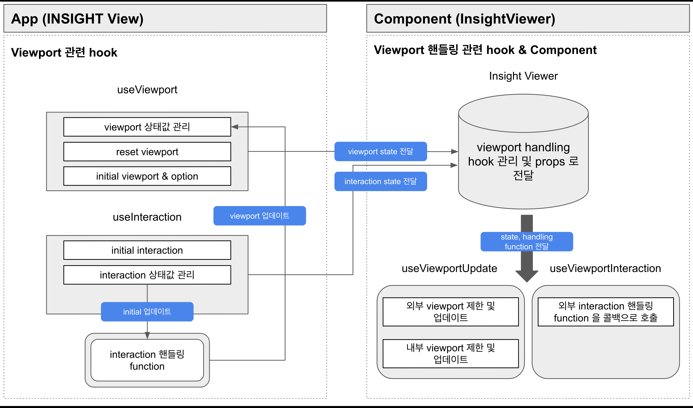
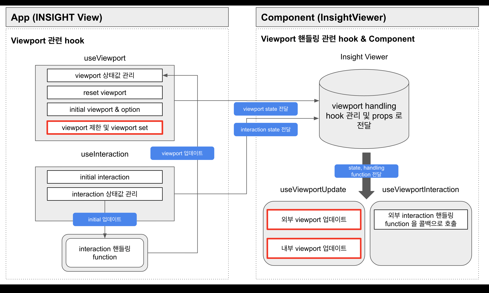

- 날짜: 2022-11-07
- version: 6.1.1

## 요약

useViewport hook 의 역할, 동작 방식을 변경하고자 합니다.

## 적용 목적 및 RFC 문서 작성의 목적

문제 작성에 앞서 팀 내에서 함꼐 논의한 문서 링크 첨부드리오니 참고 부탁드립니다.

- [useViewport hook 개선 방향 회의록](https://lunit.atlassian.net/wiki/spaces/CSF/pages/2776564476/2022-10-31+Viewport)

### 용어 정리

- **Element**: `cornerstone canvas Wrapper Div DOM Element` 를 의미합니다.

- **default viewport**: Dicom image, 위 Element 를 통해 가장 기본적인 viewport 를 의미합니다.

- **initial viewport**: default viewport 와 별개로 초기 사용자(앱)에서 설정하는 viewport 를 의미합니다.
  사용자가 scale 값을 `1.3` 이라는 상수값으로 지정하고 싶을 경우 initial viewport 의 scale 값을 `1.3` 으로 설정하는 등
  초기 viewport 를 의미힙니다.

### 문제점

> 1. useViewport 에서 default viewport 를 알 수 없다.
> 2. viewport 변경에 대한 제어권이 외부(앱), 내부(라이브러리 컴포넌트)에 같이 있다.<br />

      위 방식으로 인해 앱과 컴포넌트 간 값의 싱크가 맞지 않는 이슈가 발생한다.

### 현재 useViewport 아키텍처

기존 useViewport hook 은 InsightViewer component 의 viewport state 를 관리하는 목적의 hook 입니다.<br />

코드는 아래와 같습니다.(일부 핵심이 되는 코드만 작성했습니다.)<br />
`initialViewport prop` 의 유무에 따라 `BASE_VIEWPORT` 적용 여부를 결정합니다.

```tsx
function useViewport(
  { initialViewport, options = DEFAULT_VIEWPORT_OPTIONS }: UseViewportParams = { options: DEFAULT_VIEWPORT_OPTIONS }
) {
  const [viewport, setViewport] = useState<Viewport>({
    ...(initialViewport ? { ...BASE_VIEWPORT, _initialViewport: initialViewport } : BASE_VIEWPORT),
    _viewportOptions: options,
  })

  function resetViewport() {
    setViewport({
      ...viewport,
      _viewportOptions: options,
      _resetViewport: initialViewport ?? {},
    })
  }

  // ...useViewport 코드

  return {
    viewport,
    setViewport,
    resetViewport,
    initialized: viewport.scale !== BASE_VIEWPORT.scale,
  }
}
```

`useViewport 에서 반환하는 viewport` 를 `InsightViewer component 로 전달`하고,<br />
`InsightViewer` 는 전달 받은 Viewport 를 내부 viewport 관련 hook 인 `useViewportUpdate` 으로 전달합니다.

`useViewportUpdate` hook 은 아래와 같은 일을 합니다.<br />

> 1. 외부(앱) Viewport 를 업데이트
> 2. 외부(앱) Viewport 에 대한 값 필터링 (특정 scale 미만으로는 값을 내릴 수 없다.)

useViewport hook 은 외부(앱)에서 핸들링이 가능합니다._(setState 를 return 하므로)_<br />
이 점을 염두해두시고 아래 work flow 확인 부탁드립니다.

> 1. 앱에서 마우스 스크롤(예시)을 통해 viewport 를 업데이트하는 로직을 실행
> 2. 1번에 의해 앱에서는 viewport 가 업데이트된 상태
> 3. 업데이트된 viewport 를 InsightViewer 컴포넌트로 전달
> 4. InsightViewer 의 useViewportUpdate hook 에서 업데이트된 viewport 를 받음
> 5. 내부 검증 코드 _(제한된 scale 미만으로는 scale 값을 내릴 수 없다.)_ 를 기반으로 업데이트된 viewport 를 검증
> 6. 내부 검증 코드에 의해 제한된 값으로 viewport 업데이트

위 workflow 에서 2번, 6번을 보시면 앱과 컴포넌트 서로 다른 viewport 값이 두개가 공존합니다.<br />
`2번 앱`에서는 1번 마우스 업데이트를 통해 **업데이트된 값**을, _(이 값은 Component 에 존재하는 min limit 보다 작은 값입니다)_
`6번 컴포넌트`에서는 내부 검증 코드에 의해 **제한된 값**을 가지고 있습니다.

**이 값의 차이로 인해 앱에서 viewport scale 값 표기 시 default viewport scale 과 그 이하의 값이 계속 교차되어 보이는 문제가 있습니다.**

### 개선 방향성

1. useViewport API 를 자체적으로 default viewport 를 얻을 수 있도록 변경하는 방향으로 진행하고자 합니다.<br />
2. Viewport & InsightViewer 를 Controlled component 방식으로 관리하는 것이 좋을 것 같습니다.<br />
3. InsightViewer component 에서는 전달 받은 viewport 를 보여주는 용도로만 사용합니다.

아래 설명할 아키텍처는 위 방식을 기본으로 설명하고자 합니다.

### 기존 viewport 아키텍처 다이어그램



## 구체적인 디자인 (아키텍처)

위 목적을 기반으로 기존 아키텍처를 어떻게 변경할지에 대한 구체적인 설명을 작성합니다.<br />
문제 해결 방식은 위에 언급한 `개선 방향성`과 같이 진행했습니다.

### 1. useViewport 내에서 default viewport 를 관리

6.1.1 useViewport 구현 방식은 useViewport 에 default viewport 를 관리할 수 없다는 가정 하에 구성된 아키텍처입니다.<br />

개선안은 **default viewport 를 useViewport 에서 관리**하고자 합니다.<br />
앱에서 `default viewport` 를 통해 부가적인 validation 로직을 만들어 InsightViewer 에 전달하는 방식입니다.

위에서 예시를 들었던 scale 값 제한의 경우 useViewport 에서 동일하게 option field 를 통해 핸들링이 가능합니다.<br />
다만 **특정 조건문 + 제한된 값 업데이트하는 로직**을 InsightViewer 의 useViewportUpdate hook 이 아닌,<br />
useViewport hook 자체적으로 관리하는 방향으로 가고자합니다.<br />
위 방식은 useViewport 에서 default viewport 값을 가지고 있기 때문에 가능한 구현 방향입니다.

이렇게 될 경우, 앱에서 validation 한 값을 InsightViewer component 에선 단순 표기만 하면 되기에<br />
위와 같은 방향성을 가지고 작업할 예정입니다.<br />
더불어, 이 뜻은 **문제점 2번인 앱과 컴포넌트 간에 viewport sync 가 맞지 않는 문제를 해결**할 수 있습니다.

### 2. 예제 코드

useViewport hook 부터 코드 공유하겠습니다.

```ts
export function useViewport(
  { image, element, options = DEFAULT_VIEWPORT_OPTIONS, getInitialViewport }: UseViewportParams = {
    options: DEFAULT_VIEWPORT_OPTIONS,
  }
): {
  viewport: Viewport
  setViewport: React.Dispatch<React.SetStateAction<Viewport>>
  resetViewport: () => void
  getDefaultViewport: () => void
  initialized: boolean
} {
  const [viewport, setViewport] = useState<Viewport>({
    ...BASE_VIEWPORT,
    _viewportOptions: options,
  })

  const getDefaultViewport = useCallback(() => {
    if (image && element) {
      return getDefaultViewportForImage(element, image)
    }

    return null
  }, [image, element])

  function resetViewport() {
    const defaultViewport = getDefaultViewport()

    if (defaultViewport && getInitialViewport) {
      const initialViewport = getInitialViewport(defaultViewport)

      setViewport((prevViewport) => ({ ...prevViewport, ...initialViewport }))
    }
  }

  useEffect(() => {
    setViewport((prevViewport) => ({ ...prevViewport, _viewportOptions: { fitScale: options.fitScale } }))
  }, [options.fitScale])

  // 초기값을 할당하는 방식
  useEffect(() => {
    const defaultViewport = getDefaultViewport()

    if (defaultViewport && getInitialViewport) {
      const initialViewport = getInitialViewport(defaultViewport)

      setViewport((prevViewport) => ({ ...prevViewport, ...initialViewport }))
    }
  }, [getDefaultViewport, getInitialViewport])

  return {
    viewport,
    setViewport,
    resetViewport,
    getDefaultViewport,
    initialized: viewport.scale !== BASE_VIEWPORT.scale, // BASE_VIEWPORT.scale is 0.
  }
}
```

default viewport 를 관리하기 위해 image, element 를 parameter 로 전달 받습니다.<br />
image 는 앱에서 사용하는 useImage hook 을 통해 얻을 수 있습니다.<br />

다음 `InsightViewer component` 에 대한 코드를 공유하겠습니다.

```tsx
import React, { useRef } from 'react'
import InsightViewer, { useImage, useViewport } from '@lunit/insight-viewer'

const App = () => {
  const viewportRef = useRef<HTMLDivElement>(null)

    const { loadingState, image } = useImage({
    wadouri: 'dicom image url',
  })

  const { viewport, setViewport } = useViewport({ image, element: { viewportRef.current }})

  // viewport 사용할 element 를 얻을 수 있게 ref prop 을 추가했습니다.
  return <InsightViewer image={image} viewport={viewport} onChangeViewport={setViewport} ref={viewportRef} />
}
```

6.1.1 버전에서 수정한 useViewportUpdate hook 에 추가한 fit scale 관련 코드는 삭제할 예정입니다.

### 변경 아키텍처 다이어그램



기존 InsightViewer component 의 useViewportUpdate 에서 viewport 에 대한 제한을 삭제한 후,<br />
앱에서 사용할 useViewport 에서 viewport 를 제한합니다.

InsightViewer 에서는 Viewport 를 보여주는 목적만 가지고 있습니다.<br />
_(상황에 따라 viewport 제한 로직을 가지고 있을 수 있습니다. 이 경우 onChangeViewport 가 실행되지 않습니다.)_

## 대안

viewport 관련 문제를 해결할 별다른 대안이 떠오르지 않았습니다.<br />
다른 대안이 있다면 코멘트 부탁드립니다.

## 해결되지 않는 문제

위 방식대로 진행할 경우, 문제는 없어보입니다.<br />
혹시 내용 확인하시면서 있을 경우 코멘트 부탁드립니다.
