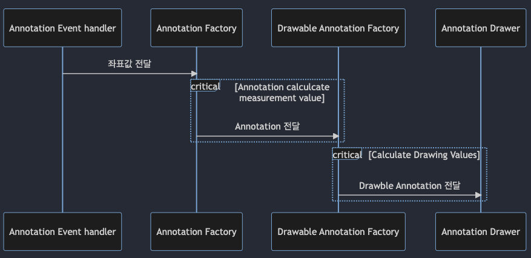

- 날짜: 2023-02-14
- INSIGHT Viewer version: 6.2.1

## 요약

- Annotation Measurement 기능을 하나로 통합하여 제공하고자 합니다.

- 핵심 로직을 라이브러리 개발자가 이해하기 쉽도록 리랙토링 하고자 합니다.

### 용어 정리

- **Annotation**: 특정 병변을 polygon, line 등으로 표기한 객체<br />
  이번 combine 건에서는 Measurement 를 포함한 형태로 정의한다.

- **Measurement**: 특정 병변을 계산된 값과 함께 ruler, area 형태로 표기한 형태

- **Pixel 좌표계**: 초기 마우스 down 이벤트가 발생된 후, cornerstone 좌표계에서 pixel 좌표계를 의미합니다.

- **Canvas 좌표계**: 기존 pixel 좌표계에서 실제 유저에게 보여지는 좌표값을 의미합니다.<br />
  이 역시도 cornerstone canvas 좌표계를 의미합니다.

## 적용 목적 및 RFC 문서 작성의 목적

적용 목적은 하기 작성될 현재 아키텍처의 문제점을 해결하기 위함입니다.

해당 RFC 문서는 현재 아키텍처의 문제점을 공유하고, 이를 해결하기 위한 방향이 무엇인지<br />
어떻게 해결할 수 있는지에 대한 내용 공유 및 관련 PR 의 이해를 돕기 위한 목적을 가지고 있습니다.

### 문제점

> #### 1. 사용하는 앱에서 여러 개의 레이어를 발생, 예상치 못한 에러 발생

Annotation, Measurement 는 계산된 값의 유무 차이만 존재합니다.<br />
이를 별도의 Annotation, Measurement 로 분리하여 제공하는 것은 큰 의미가 없으며,<br />
오히려 각각의 고유한 DOM 레이어를 제공합니다. 이는 최대 4개의 Drawer, Viewer DOM 레이어를 제공하여<br />
실제 사용하는 앱에서 예상치 못한 동작을 야기하는 원인이 되곤 합니다.<br />
_(e.g: 이벤트가 상위 레이어에서만 발생하는 문제 발생)_

> #### 2. 비슷한 코드 중복 작성

앞서 1에서 언급한 것과 같이 Annotation, Measurement 는 계산된 값의 유무 차이만 존재합니다.<br />
즉 그외에는 전부 동일한 방식으로 동작한다는 의미입니다.

그러나 이 둘은 각자 고유한 로직을 가지고 있으며 이로 인해 중복된 코드가 지속적으로 발생되고,<br>
이는 곧 관리해야하는 코드가 많아지는 원인이 됩니다.

> #### 3. canvas, pixel 좌표계

기존 아키텍처는 canvas, pixel 좌표계가 어느 시점에 적용되고, 해제되는지 생각하면서 코드를 작성해야합니다.<br />
개발할 때 난이도를 높이는 원인이 됩니다.

> #### 4. Annotation 생성, Drawing 좌표값 계산 로직이 혼용되어 존재

Annotation 생성, Drawing 좌표값 계산 등이 하나의 함수에서 진행됩니다. <br />
이로 인해 3번 문제가 발생하고, 코드 유지 보수에 어려움을 발생시킵니다.

## 구체적인 디자인 (아키텍처)

---

위 목적을 기반으로 기존 아키텍처를 어떻게 변경할지에 대한 구체적인 설명을 작성합니다.<br />

> 1. 문제를 해결하기 위한 솔루션
> 2. 간단한 예제 코드
> 3. 아키텍처 다이어그램 (optional)

### 개선 방향성

- 1. Annotation, Measurement type, Component(Overlay 등), Code 를 Annotation 하나로 통합하고자 합니다.<br />
     이와 동시에 Annotation, Measurement 용어도 Annotation 하나로 통합하고자 합니다.
- 2. Annotation, Edit Point CRUD 등을 각 역할에 맞게 완전 분리하고자 합니다.
- 3. 코드 작성 시, Canvas, Pixel 좌표계를 고려하지 않는 방향으로 개선하고자 합니다.

### 현재 Annotation, Measurement 아키텍처

#### 문제점 1,2 관련 내용

이전 Annotation 시퀀스 다이어그램


이전 Annotation, Measurement 는 위와 같은 아키텍처로 구성되어 있습니다.<br />
Annotation, Measurement 각각 동일한 아키텍처를 사용 호출하며 실제 사용 코드는 아래와 같습니다.

```tsx
<>
  <AnnotationOverlay
    isDrawing={!!annotationMode}
    isEditing={!!annotationMode}
    mode={annotationMode}
    lineHead={mouseMode === 'annotation-arrow' ? 'arrow' : 'normal'}
    annotations={_annotations}
    hoveredAnnotation={hoveredAnnotation}
    selectedAnnotation={selectedAnnotation}
    onAdd={onAdd}
    onFocus={annotationMode ? hoverAnnotation : undefined}
    onRemove={annotationMode ? removeAnnotation : undefined}
    onSelect={selectAnnotation}
  />
  <MeasurementOverlay
    isDrawing={!!measurementMode}
    isEditing={!!measurementMode}
    mode={measurementMode}
    measurements={_measurements}
    selectedMeasurement={selectedMeasurement}
    hoveredMeasurement={hoveredMeasurement}
    onAdd={onAdd}
    onFocus={measurementMode ? hoverMeasurement : undefined}
    onRemove={measurementMode ? removeMeasurement : undefined}
    onSelect={selectMeasurement}
  />
</>
```

Annotation, Measurement 명칭만 다른 동일한 목적의 props 가 대부분이며,<br />
이에 대한 내부 코드 역시 동일한 방식으로 동작합니다.

또한 이렇게 사용할 경우, 하위에 존재하는 MeasurementOverlay 레이어는 상위에 존재하는<br />
AnnotationOverlay 레이어에 의해 이벤트가 동작하지 않는 이슈 역시 발생합니다.

물론 이 문제는 다른 방식으로 해결이 가능하나 아키텍처도 문제이므로 이를 하나의 Overlay 로 통합하여 제공하고자 합니다.<br />
예제 코드는 아래와 같습니다.

```tsx
// 여기서 Annotation 은 기존 Measurement 를 포괄한 개념을 의미합니다.
<AnnotationOverlay
  isDrawing={isDrawing}
  isEditing={isEditing}
  width={700}
  height={700}
  mode={annotationMode}
  elements={annotations}
  hoveredElement={hoveredAnnotation}
  selectedElement={selectedAnnotation}
  showAnnotationLabel={isShowLabel}
  onAdd={addAnnotation}
  onFocus={hoverAnnotation}
  onRemove={removeAnnotation}
  onSelect={selectAnnotation}
/>
```

위와 같이 하나의 AnnotationOverlay 로 `Annotation`, `Measurement` 를 동시에 대응하고자 합니다.<br />
이와 더불어 명칭 역시 `Annotation` 하나로 통일하고자 합니다.

`Measurement`는 큰 Annotation 개념 하에 측정값이 존재하는 것을 의미합니다.<br />
이에 따라 `Annotation` 으로 명칭해도 무리가 없다는 판단 하에 `Annotation` 으로 네이밍을 통합하고자 합니다.

위 방식을 통해 문제점 1 **사용하는 앱에서 여러 개의 레이어를 발생, 예상치 못한 에러 발생** 과<br />
문제점 2 **비슷한 코드 중복 작성** 를 해결하고자 합니다.

#### 문제점 3,4를 해결을 위한 내용

이전 Annotation 시퀀스 다이어그램


이전 Annotation 시퀀스 다이어그램에서 **Annotation Factory**은 많은 일을 담당하고 있습니다.

- > 1. Annotation CRUD
- > 2. Edit Point CRUD
- > 3. Area, Ruler 의 측정값 계산
- > 4. canvas, pixel 좌표계 관리

이는 코드 유지 보수에 어려움을 발생시키는 원인이며, 많은 로직이 하나의 function 에 집중되어<br />
코드 파악 및 흐름 이해를 방해하는 주 원인입니다.<br />
이를 해결하기 위해 각 역할을 분리하고자 합니다.



위 아키텍처를 보면 Annotation Factory, Annotation Drawer 사이에 <br />
Drawable Annotation Factory 가 추가되었습니다. <br />

Annotation Factory 에서는 `Annotation CRUD` 만 다룹니다.<br />
Drawable Annotation Factory 에선 Drawing 에 필요한 좌표값을 계산합니다.

이를 통해 문제점 3 **canvas, pixel 좌표계가 혼용되어 사용된다는 문제점을 해결할 수 있습니다.**<br />
기존에는 좌표계를 생각하며 코드를 작성해야했습니다.

- 1. Annotation 초기 CRUD 에 대한 코드는 pixel 좌표계를 사용해야한다.
- 2. Annotation Drawing 을 위한 값은 canvas 좌표계를 사용해야한다.

이번 변경을 통해 아래와 같이 생각할 수 있을 것으로 예상됩니다.

- 1. Annotation CRUD 에 대한 코드는 Annotation Factory 에서 수정한다.
- 2. Annotation Drawing 을 위한 값은 Drawable Annotation Factory 에서 수정한다.

이를 통해 개발자가 Canvas, Pixel 좌표계를 생각할 필요가 없도록 개선하고자 합니다.

문제점 4 **Annotation 생성, Drawing 좌표값 계산 로직이 혼용되어 존재**는 아래와 같이 해결하고자 합니다.

기존 코드에서 Annotation Factory 에 해당하는 부분은 `useAnnotationPointHandler` 입니다.<br />
`Edit Point 를 계산`하고, canvas, pixel 좌표계를 이용하여 `Annotation CRUD`<br />
`Drawing 좌표계 계산` 등을 담당하는 것을 아래와 같이 나누었습니다.

1. Annotation Factory 는 기존 역할에서 `Annotation CRUD` 만 담당하고 있습니다.
2. Drawable Annotation Factory 는 기존 역할에서 `Drawing 좌표계 계산` 을 담당합니다.
3. `Edit Point 계산`은 별도의 function 으로 분리하여 계산합니다.

이에 대한 코드는 해당 내용을 기반으로 작업한 별도의 PR 에서 참고하시면 좋을 것 같습니다.

#### Annotation Factory 코드 개선

Annotation Factory 에서 `Edit Start`, `Current Point` 에 대한 값을 기존과 동일하게 관리합니다.<br />
기존 코드에서는 Annotation CRUD 코드 내에서 `Edit Start`, `Current Point` 값 할당 해제도 함께 다뤘는데,<br />
이 또한 분리하고자 합니다.

내부적으로 관리는 하되, `Annotation CRUD`, `Edit Start CRUD` 는 별도의 function 으로 관리<br />
event handler 에서 콜백으로 요청하는 타이밍에서 이를 제어하는 방향으로 개선하고자 합니다.

이를 통해 CRUD function 은 관련된 코드만을 관리하며, 이벤트 레벨에서 mouse down, up, move 시<br />
실행되는 function 을 구분 관심사 분리의 목적을 가져가며, 코드 이해, 관리 측면에서 분명한 이점을 가져가고자 합니다.

## 대안

로직을 분리할 수 있는 아키텍처를 계속 구상했지만, 현재 구조가 제일 이상적으로 생각됩니다.<br />
다른 좋은 아키텍처 혹은 대안이 있다면 공유 부탁드립니다.

## 해결되지 않는 문제 + 좀 더 개선이 필요한 부분

- 1. 기존 앱에서 발생한 레이어가 겹쳐져서 발생하는 이슈는 근본적으로 해결하진 못했습니다.<br />
     만약 해당 Overlay 를 두 번 사용하게 된다면 동일한 이슈가 발생합니다.

- 2. Edit Point 관련 function 을 `AnnotationDrawer` Component 에서 직접 호출하고 있습니다.<br />
     세부 구현 사항은 함수 내에 작성되어 있으나, 관련해서 필요한 값, 상태 역시 분리하고 싶습니다.<br />
     마땅한 구현 방식이 떠오르지 않아 직접 호출해서 사용하는 방향으로 사용하고 있습니다.

- 3. 추후 별도의 RFC 문서로 논의가 필요할 것 같은 부분이나 미리 내용 공유드립니다.<br />
     Annotation 관련 이벤트를 처리하기 위한 별도의 아키텍처가 필요할 것 같습니다.<br />
     hook 을 호출하는 방식은 좋은 구조가 아니므로 개선이 필요합니다.
