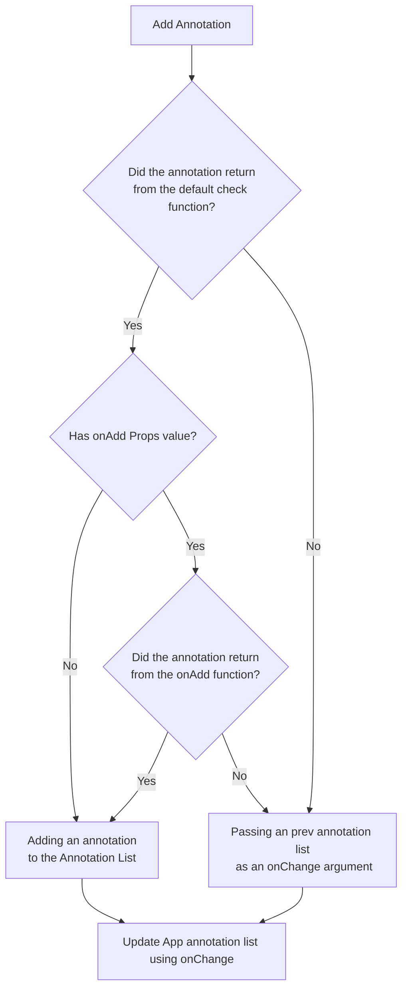
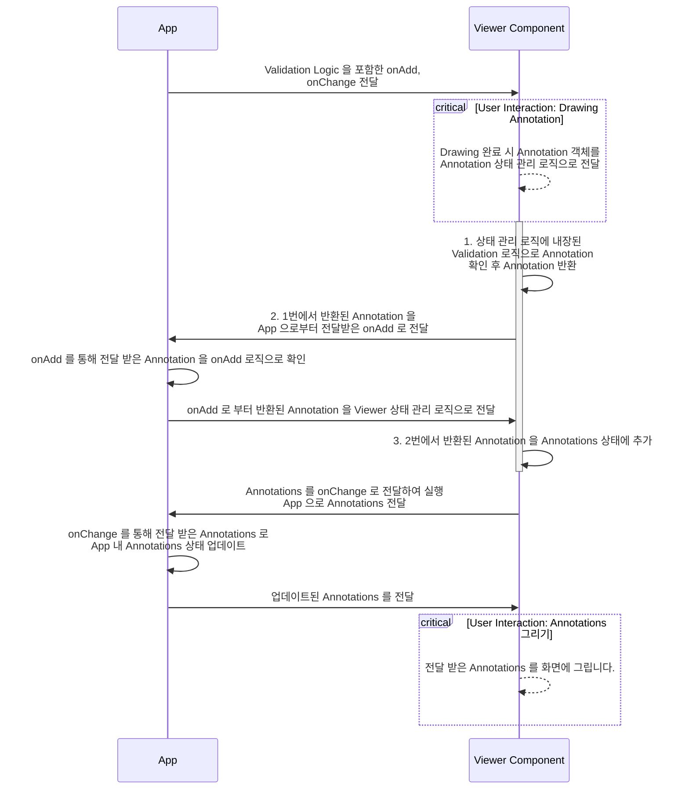

- 날짜: 2023-03-14
- INSIGHT Viewer version: 6.2.1

## 요약

- AnnotationOverlay 에서 annotations 를 핸들링할 수 있는 onChange Props 를 제공합니다.

- 라이브러리 사용자가 annotations 핸들링을 보다 용이하게 할 수 있도록 기능 구현하고자 합니다.

- AnnotationOverlay props 중 목적이 불분명한 네이밍으로 혼동을 줄 수 있는 부분을 개선하고자 합니다.

### 용어 정리

해당 RFC 문서 내 반복적으로 나오는 용어들의 용도, 설명을 작성합니다.

- **App**: INSIGHT Viewer 라이브러리를 사용하는 프로젝트를 의미합니다. (라이브러리 사용자의 프로젝트)

- **Viewer Component**: INSIGHT Viewer 라이브러리 내 Annotation 을 핸들링하는 컴포넌트를 의미합니다. (라이브러리 자체 Annotation 컴포넌트)

- **onAdd**: Annotation Add 동작 실행 시점에서 함께 실행하는 함수를 의미합니다.<br />App 에서 선언하여 add 동작에 대한 커스텀(정의)를 할 수 있습니다.<br />이 함수는 InsightViewer Component props 로 전달하여 사용합니다.

- **onChange**: Annotations 에 대한 `Add`, `Update`, `Delete` 동작 시점에서 함께 실행하는 함수를 의미합니다.<br />App 에서 선언하여 App 내 Annotations 업데이트를 수행할 목적으로 사용할 수 있습니다.<br />이 함수는 InsightViewer Component props 로 전달하여 사용합니다.

## 적용 목적 및 RFC 문서 작성의 목적

적용 목적은 하기 작성된 개선 가능한 부분을 적용하기 위함입니다.

해당 RFC 문서는 현재 `INSIGHT Viewer` annotations 핸들링 방식의 불편함이 무엇인지<br />
이러한 불편함을 어떻게 개선할 수 있는지에 대한 방안을 공유하는 목적을 가지고 있습니다.

### 기존 버전 INSIGHT Viewer annotations 핸들링 방식의 불편함

> #### 1. 라이브러리 사용자의 Annotations CRUD 로직 반복 사용

실제 라이브러리를 사용하는 일부 코드를 참고하여 설명하겠습니다.<br />
하기 작성된 코드는 annotation 을 추가할 때 annotations 를 업데이트 하는 로직입니다.

```tsx
const onAdd = useCallback(
  (annotation: Annotation) => {
    const newAnnotations = [..._annotations]
    const changed = addAnnotation(annotation)
    if (!changed) {
      return
    }

    const changedIndex = newAnnotations.findIndex((a) => a.id === changed.id)
    if (changedIndex === -1) {
      // just added
      newAnnotations.push(changed)
    } else {
      // edited
      newAnnotations[changedIndex] = changed
    }
    onChange(newAnnotations)
  },
  [_annotations, addAnnotation, onChange]
)
// ... some code

return (
  <AnnotationOverlay
    // ... some props
    onAdd={onAdd}
  />
)
```

위와 같이 onAdd 함수를 선언한 후 `parameter` 로 전달받은 `annotation`, 기존에 따로 관리하고 있는<br />
`annotations` 를 이용하여 업데이트하는 방식을 사용했습니다.

INSIGHT Viewer 라이브러리에선 `annotations` 를 활용하므로 라이브러리 사용자는 위 로직을<br />
동일하게 사용할 가능성이 매우 높다고 판단했습니다.

더불어 현재는 `Add(Create)` 일 경우에 대한 내용만 다뤘지만 이는 `Update`, `Delete` 와 같이<br />
annotations 에 영향을 미칠만한 이벤트가 발생할 경우 비슷한 로직을 반복해서 사용해야합니다.

> #### 2. AnnotationOverlay props 목적이 불분명한 네이밍

개선이 필요한 네이밍은 `isEditing`, `isDrawing` 크게 두가지입니다.<br />
isEditing 은 edit mode 여부를 결정하는 boolean 값입니다.<br />

isEditing 의 경우 true, false 에 따라 `AnnotationViewer 의 기본 동작이 변경`됩니다.<br />
isEditing 이 `false` 인 경우엔 `annotation remove` 를,<br />
isEditing 이 `true` 인 경우엔 `annotation select` 방식으로 동작합니다.

현재 네이밍은 사용자로 하여금 혼동을 유발할 가능성이 있다고 판단했습니다.

isDrawing 은 Overlay 를 View 목적으로만 사용할지 여부를 결정하는 boolean 값입니다.<br />
isDrawing 이 false 인 경우엔 `annotation Read` 기능만 사용할 수 있습니다.

## 구체적인 디자인 (아키텍처)

---

위 목적을 기반으로 기존 아키텍처를 어떻게 변경할지에 대한 구체적인 설명을 작성합니다.<br />

> 1. 문제를 해결하기 위한 솔루션
> 2. 간단한 예제 코드
> 3. 아키텍처 다이어그램 (optional)

### 개선 방향성

- 1. 반복된 CRUD 로직을 개선하기 위해 onChange prop 을 도입합니다.
- 2. 네이밍 그리고 type을 보다 직관적으로 개선하고자 합니다.

### onChange 도입

onChange prop 을 통해 CRUD 가 반영된 annotation list 를 전달하고자 합니다.<br />
실제 사용하게 된다면 아래와 같이 코드를 작성할 수 있습니다.

<table>
  <tr>
    <th> onChange 적용 전 </th> <th> onChange 적용 후 </th>
  </tr>
  <tr>
  <td>

```tsx
const onAdd = useCallback(
  (annotation: Annotation) => {
    const newAnnotations = [..._annotations]
    const changed = addAnnotation(annotation)
    if (!changed) {
      return
    }

    const changedIndex = newAnnotations.findIndex((a) => a.id === changed.id)
    if (changedIndex === -1) {
      // just added
      newAnnotations.push(changed)
    } else {
      // edited
      newAnnotations[changedIndex] = changed
    }
    onChange(newAnnotations)
  },
  [_annotations, addAnnotation, onChange]
)
// ... some code

return (
  <AnnotationOverlay
    // ... some props
    onAdd={onAdd}
  />
)
```

  </td>
  <td>

```tsx
// 개선 코드 (onChange 적용)
const [annotations, setAnnotations] = useState<Annotation[]>([])

const handleAnnotationChange = (annotations: Annotation[]) => {
  setAnnotations(annotations)
}

return (
  <AnnotationOverlay
    // ... some props
    onChange={handleAnnotationChange}
  />
)
```

  </td>
  </tr>
</table>

이를 통해 반복적으로 사용했던 onAdd 와 같은 코드를 위와 같이 줄일 수 있습니다.<br />

만약 `add`, `delete`, 사용자가 커스텀을 하고 싶을 경우를 대비해 아래와 같이 설계하고자 합니다.<br />
기존 `onAdd`, `onDelete` props 의 타입은 `(annotation: Annotation) => void` 입니다.<br />
이를 `(annotation: Annotation) => Annotation` 으로 변경합니다.<br />

그리고 아래 workflow 처럼 아키텍처를 구성합니다.

### onChange + onAdd 플로우 차트



변경된 타입에 따라 onAdd, onDelete 는 annotation 을 return 합니다.<br />
만약 사용자가 onAdd, onDelete 를 하게 될 경우, 추가 삭제할 때 해당 function 을 먼저 실행<br />
실행 후 return 된 value 를 onChange 로 전달하여 onChange 시, 커스텀을 할 수 있도록 workflow 를 형성했습니다.

만약 onAdd, onDelete 가 없다면 App 내 Base validation 이 반영된 값을 전달합니다.<br />
내부적으로 state 관리가 필요하므로 useAnnotation hook 을 AnnotationOverlay 에서 사용하고자 합니다.

동작 방식은 `input` 과 비슷하다고 생각하시면 될 것 같습니다.

추가로 onChange, onAdd 가 모두 있다는 가정 하에 그린 sequence Diagram 입니다.

### onChange + onAdd 시퀀스 다이어그램



## 대안

---

사용성 개선 + React 에서 일반적으로 사용하는 방식을 고려했을 때 기존 아키텍처와 기존 onAdd 코드를 사용하는 방법 혹은<br />
onChange 대입을 통한 해결 방안 정도 밖에 생각나지 않네요.

더 좋은 방법, 현재 방식의 문제점이 있다면 짚어주시길 바랍니다.

## 해결되지 않는 문제

---

따로 없습니다.
