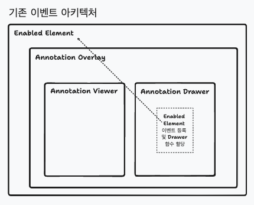

- 날짜: 2023-05-02
- INSIGHT Viewer version: 6.2.1

## 요약

---

- AnnotationDrawer 내 이벤트 핸들러 방식을 개선합니다.

- addEventListener, removeEventListener 를 반복 실행하는 코드를 제거합니다.

- 문제를 풀기 위한 방향은 2개입니다.<br />

  1. AnnotationViewer, AnnotationDrawer Layer 통합<br />
  2. Rxjs 를 통한 이벤트 로직 분리<br />

  이 중 1번에 대한 내용을 중점적으로 다룹니다.

### 용어 정리

해당 RFC 문서 내 반복적으로 나오는 용어의 목적 및 설명을 작성합니다.

- **AnnotationViewer**: 이미 그려진 annotation list 에 대해 표기해주는 Component 를 의미합니다.

- **AnnotationDrawer**: 현재 그리고 있는 annotation 에 다해 표기해주는 Component 를 의미합니다.

- **EnabledElement**: INSIGHT Viewer 최상위에 위치한 Dom 을 의미하며, 현재 Drawing 이벤트 핸들링을 담당하는 DOM 을 지칭합니다.

- **Event**: Viewer 화면 내 마우스 이벤트를 지칭합니다.

- **Overlay**: AnnotationViewer, AnnotationDrawer 를 포괄적으로 지칭합니다.

- **Annotation**: Line, Polygon, Area 와 같이 특정 형태로 Dicom Image 위에서 그리는 것을 지칭합니다.

- **Layer**: 하나의 Dom 계층을 의미합니다. 현재는 크게 `AnnotationViewer Layer`, `AnnotationDrawer Layer` 2개가 있습니다.

## 적용 목적 및 RFC 문서 작성의 목적

---

### 현재 방식에 대한 설명 및 문제점

> #### 1. 화면 상에 Drawing 할 때, Event 등록, 제거 로직 반복 실행

현재 INSIGHT Viewer 라이브러리에서 Edit, Drawing 기능을 사용할 때, Event 등록, 제거 로직이<br />
반복되어 실행됩니다. 이는 하나의 Annotation 을 그릴 때 약 600번 반복 실행됩니다.

현재까지 이 방식으로 인해 눈에 띄는 퍼포먼스 저하의 사례는 없으나<br />
이벤트 등록, 해제를 React 에서 제공하는 `on~~` 핸들러를 사용하지 않고 직접 핸들링한다는 점에서<br />
안정성, 퍼포먼스 측면에서 여러 이슈가 발생할 가능성이 있습니다.

> #### 2. 관심사 분리

일반적으로 AnnotationDrawer 내에서 이벤트 핸들러 로직이 있다면 AnnotationDrawer Dom Element 에<br />
관련된 이벤트를 다루고 있을 것이며, 등록 대상 Dom 역시 AnnotationDrawer 로 인지할 것입니다.

하지만 실제 이벤트 등록 대상 Dom 은 `EnabledElement` 로 코드 파악에 부정적 영향을 주며,<br />
`EnabledElement` 에 대한 로직을 `AnnotationDrawer` 에서 다룬다는 점에서 관심사 분리 측면에서 좋은 구조가 아니라고 생각합니다.

현재 구조는 아래 두 가지 문제점을 해결하기 위한 방향이였습니다.

1. AnnotationDrawer Layer 는 Annotation 을 그리지 않는다면 생성되지 않습니다.<br />
2. AnnotationDrawer Layer 가 항상 존재하면, AnnotationViewer Layer 이벤트가 실행하지 않습니다.

위 두 문제를 해결하기 위해 항상 존재하는 `EnabledElement` 에 이벤트를 할당하고,<br />
이벤트 콜백 실행 함수에 AnnotationDrawer 내 함수를 할당하여, Annotation Drawing 기능을 구현했습니다.

### 문제를 풀기 위한 방향

가장 근본적인 문제인 Layer 가 겹쳐서 이벤트가 발생하지 않는 문제를 해결하려고 합니다.<br />
AnnotationViewer, AnnotationDrawer Layer 를 하나로 통일하여, 해당 레이어에서<br />
이벤트 등록을 진행하고자 합니다.

## 구체적인 디자인 (아키텍처)

---

### 개선 방향성

- 1. AnnotationViewer, AnnotationDrawer Layer 를 하나로 통합합니다.
- 2. 통일된 1개의 Layer Dom 에 이벤트를 등록합니다.

### AnnotationViewer, AnnotationDrawer Layer 통합

현재 AnnotationViewer, AnnotationDrawer Layer 는 완전 분리되어 있습니다.<br />
각각의 Layer 는 svg 로 wrapping 한 상태이며, width, height 가 100% 이므로<br />
Viewer 화면을 꽉 채우는 형태입니다.

```tsx
export const AnnotationOverlay = (
  {
    // props...
  }
) => {
  // 비즈니스 로직...

  return (
    <>
      <AnnotationsViewer
      // props ...
      />
      <AnnotationDrawer
      // props ...
      />
    </>
  )
}
```



이렇게 Layer 가 두 개가 되면서 이벤트 핸들링에 여러 어려움을 겪었습니다.<br />
그래서 이를 하나의 Layer 로 통합하는 방향으로 수정하고자 합니다.

네이밍은 편의를 위해 직관적인 네이밍으로 수정하였으니, 참고 부탁드립니다.<br />
_(실제 구현 시엔 다른 네이밍을 사용할 수 있습니다.)_

```tsx
export const ViewerAndDrawer = (
  {
    // props...
  }
) => {
  // 비즈니스 로직...

  return (
    <svg>
      {/** 기존 AnnotationDrawer 에 Annotation Viewer 를 추가 */}
      <AnnotationViewer />

      <PolylineDrawer />
      <RulerDrawer />
      <AreaDrawer />
      <TextDrawer />
    </svg>
  )
}
```

위와 같이 하나의 svg Layer 안에서 AnnotationViewer, Drawer Element 를 두는 방식입니다.<br />
이를 통해 두 개의 Layer 가 겹치는 이슈를 해결하고자 합니다.

실제 이벤트 할당은 아래와 같이 될 예정입니다.

```tsx
export const ViewerAndDrawer = ({
  // props...
  onClickAnnotation,
}) => {
  // 비즈니스 로직...

  // 각 이벤트 핸들러에는 이벤트 버블링 등을 막는 처리 로직 추가
  const handleMouseDown = () => {}
  const handleMouseMove = () => {}
  const handleMouseUp = () => {}

  return (
    <svg onMouseDown={handleMouseDown} onMouseMove={handleMouseMove} onMouseUp={handleMouseUp}>
      {/** 기존 AnnotationDrawer 에 Annotation Viewer 를 추가 */}
      <AnnotationViewer onClick={onClickAnnotation} />

      <PolylineDrawer />
      <RulerDrawer />
      <AreaDrawer />
      <TextDrawer />
    </svg>
  )
}
```


굳이 `EnabledElement` 로 접근하여 라이브러리 개발자가 event handling 을 하는 수고를 덜고<br />
레이어가 겹쳐서 발생하는 AnnotationViewer 의 이벤트 사용 불가 이슈를 해결할 수 있는 방향으로 생각됩니다.

더불어 이러한 통합을 통해 불필요하게 AnnotationDrawer 레이어의 렌더링을 optional 하게 처리하는 로직도<br />
삭제할 수 있습니다. 이는 위에 설명한 이유를 알고 있지 않는다면 해당 Layer 를 optional 하게 렌더링하는<br />
이유를 파악하기 어렵다고 생각하였고, 이 역시도 라이브러리 관리 측면에서 부정적 영향을 준다고 생각합니다.

<table>
  <tr>
    <th> Layer 통합 전 </th> <th> Layer 통합 후 </th>
  </tr>
  <tr>
  <td>

```tsx
export const AnnotationDrawer = ({
  // props...
  onClickAnnotation,
}) => {
  // 비즈니스 로직...

  // EnabledElement 접근 후 이벤트 할당 hook
  useDrawingHandler({
    svgElement: svgRef,
    hoveredDrawing: hoveredAnnotation,
    setInitialPoint: (point: Point) => {
      // 비즈니스 로직
    },
    addDrawingPoint: (point) => {
      // 비즈니스 로직
    },
    cancelDrawing: () => {
      // 비즈니스 로직
    },
    addDrewElement: () => {
      // 비즈니스 로직
    },
  })

  return (
    <svg>
      <PolylineDrawer />
      <RulerDrawer />
      <AreaDrawer />
      <TextDrawer />
    </svg>
  )
}
```

  </td>
  <td>

```tsx
export const ViewerAndDrawer = ({
  // props...
  onClickAnnotation,
}) => {
  // 비즈니스 로직...

  const handleMouseDown = () => {}
  const handleMouseMove = () => {}
  const handleMouseUp = () => {}

  return (
    <svg onMouseDown={handleMouseDown} onMouseMove={handleMouseMove} onMouseUp={handleMouseUp}>
      {/** 기존 AnnotationDrawer 에 Annotation Viewer 를 추가 */}
      <AnnotationViewer onClick={onClickAnnotation} />

      <PolylineDrawer />
      <RulerDrawer />
      <AreaDrawer />
      <TextDrawer />
    </svg>
  )
}
```

  </td>
  </tr>
</table>

## 대안

---

## Rxjs 를 사용한 이벤트 로직 분리

[Rxjs](https://rxjs.dev/) 를 사용하여 EnabledElement 로 접근 후 이벤트 할당하는 로직을 개선하는 방향입니다.<br />
아직 자세한 구현 방식은 수립하지 못했으나, 구현하고자 하는 방향은 아래와 같습니다.

EnabledElement 에 `fromEvent` 를 사용하여 이벤트를 observable 객체로 만듭니다.<br />
이후 subscribe method 를 활용하여 해당 observable 객체를 구독하여 트래킹을 하고<br />
해당 이벤트가 발생했을 때 지금의 콜백 함수들을 실행하는 방향으로 구현하고자 합니다.

### 위 방식의 이점?

#### 1. 기존 이벤트 등록, 해제가 반복적으로 실행되는 이슈를 해결할 수 있습니다.

React 라이프사이클 밖에서 EnabledElement 이벤트를 관리하게 되어<br />
반복적으로 할당, 해제되는 이슈를 해결할 수 있습니다.

#### 2. 상대적으로 적은 수정 사항

AnnotationViewer, AnnotationDrawer layer 통합은 생각보다 큰 작업이 될 수 있습니다.<br />
그러나 Rxjs 를 통한 이벤트 로직 분리 작업은 현재 이벤트 등록 방식을 Rxjs 로 전환하는 마이그레이션<br />
비용만 들어갈 것으로 예상됩니다.

### 이 방식을 채택하지 않은 이유?

리소스가 덜 들어간다고 했으나, 그렇게 큰 차이는 없을 것으로 예상됩니다.<br />
해당 RFC 의 목적인 `Event 등록, 해제 반복하는 문제 해결` 에는 부합하지만<br />
기존과 동일하게 Layer 가 두 개 존재한다는 점에서 해당 방식을 채택하지 않았습니다.

현재 INSIGHT Viewer 는 Layer 가 두 개라는 점으로 인해 발생하는 불필요한 로직이 있습니다.<br />
그리고 예상치 못한 동작 방식 역시 있습니다. 현재 이를 위해 css 를 활용한 해결, js 코드를 통한 해결 등<br />
부수적으로 관리해야하는 로직이 늘어나고 있습니다.

이는 앞으로도 해당 라이브러리를 사용하는 프로젝트가 많아질수록 늘어날 것으로 보입니다.<br />
앞으로 유지보수 하는데 있어 불필요한 비용으로 생각되며, Layer 를 하나로 줄이는 것은<br />
장기적인 관점에서 큰 이득을 가져간다고 생각합니다.

위와 같은 이유로 위 Rxjs 를 사용한 이벤트 분리 방식을 메인으로 채택하지 않았습니다.<br />
혹시나 다른 의견을 가지고 있으시다면 편하게 의견 공유 부탁드립니다.

## 해결되지 않는 문제

---

따로 없습니다.
